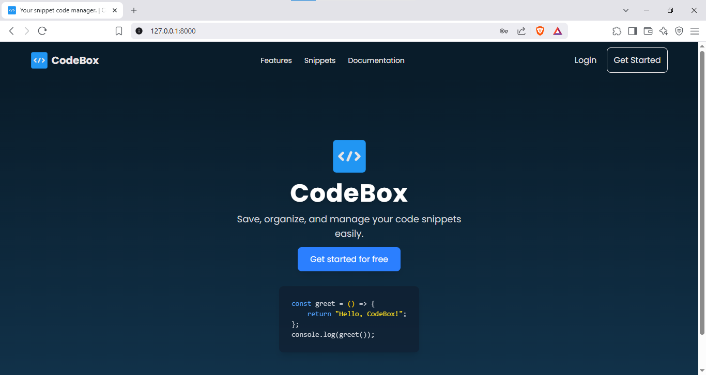
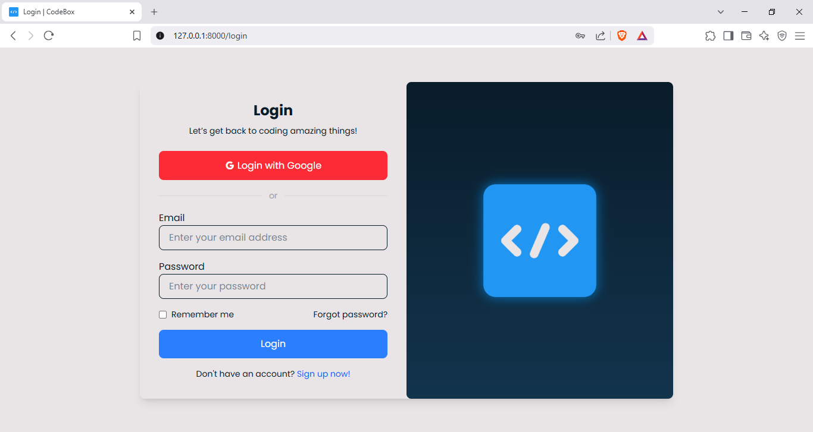
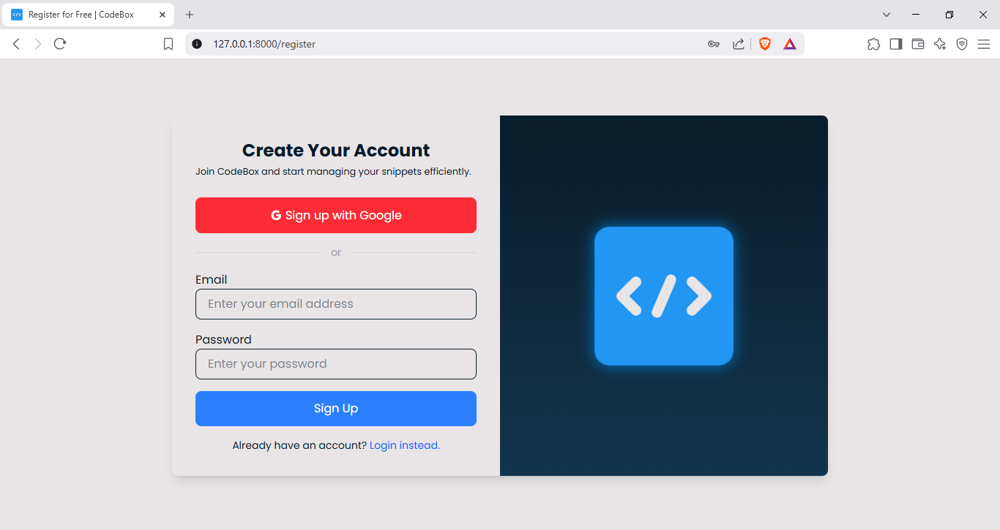
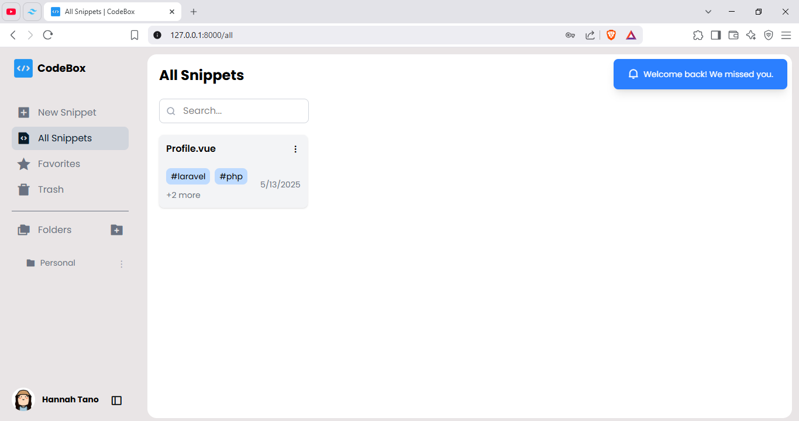
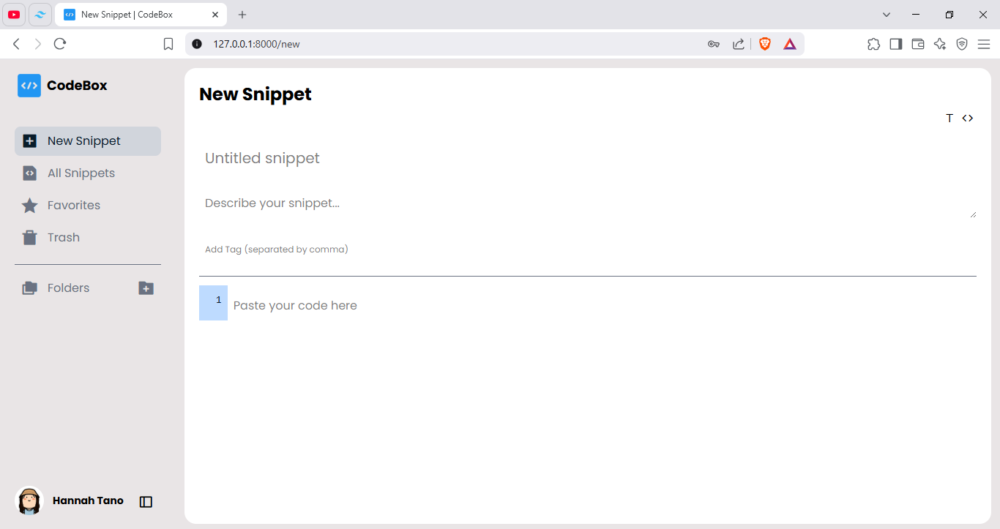
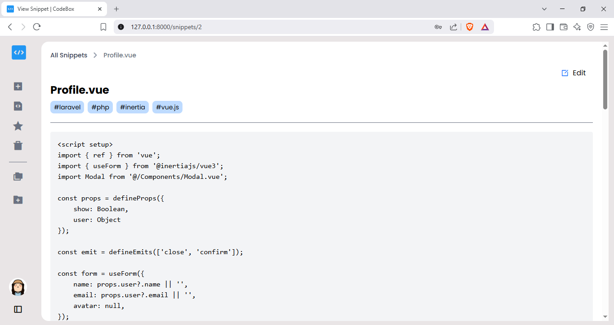
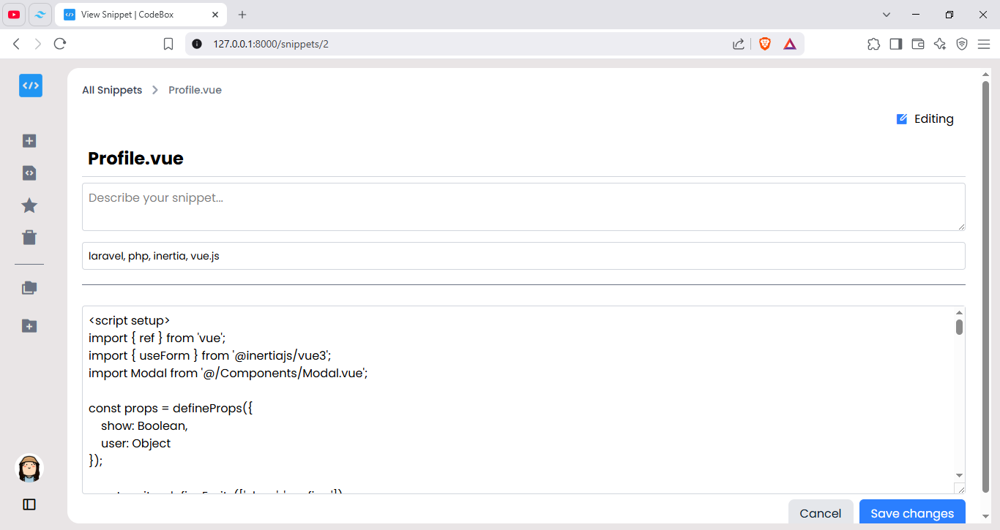
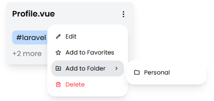
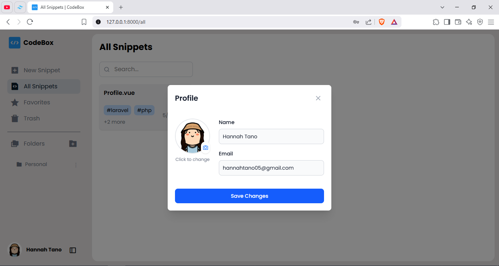

# CodeBox - Code Snippets Manager

## 📌 Project Overview  
CodeBox is a web-based application designed to help developers store, organize, and manage their code snippets efficiently.

## 🔧 Technologies Used  
**Framework:** Laravel
**Frontend:** Vue.JS
**Backend:** PHP  
**Database:** SQLite

## 🚀 Features  
**✅ User authentication (Login/Register)**  
**✅ Add, edit, and delete code snippets**  
**✅ Organize snippets by tags and category (e.g., Personal, Work)**  

📸 Screenshots  
  
  
  
  
  
  
  
  
  

## 👥 Contributors  
Hannah Grace M. Tano – Full Stack Developer
